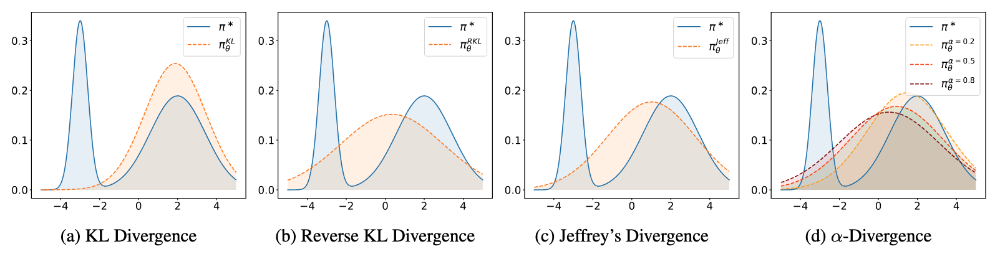

# $f$-PO: Generalizing Preference Optimization with $f$-divergence Minimization

> Jiaqi Han*, Mingjian Jiang*, Yuxuan Song, Jure Leskovec, Stefano Ermon, Minkai Xu*^
> <br>*Equal contribution. ^Corresponding author.
> <br>**Stanford University**

[](https://github.com/MinkaiXu/fPO/blob/main/LICENSE)
[](https://arxiv.org/abs/2410.21662)

## Introduction

We introduce $f$-PO, a novel approach that generalizes preference optimization via minimizing the $f$-divergence through solving certain distribution matching problem.
The method subsumes existing offline preference optimization methods like DPO while inspiring new formulations by exploring other members in the $f$-divergence family.
Results demonstrate the efficacy of $f$-PO on a wide suite of benchmarks, including, e.g., AlpacaEval, MT-Bench, ArenaHard, and more.



## Checkpoints

We provide the checkpoints of the models trained in the paper. The checkpoints are hosted on Hugging Face Hub. You can download the checkpoints using the following links:

- [mistral-7b-base-fpo](https://huggingface.co/mkxu/mistral-7b-base-fpo)
- [llama-3-8b-instruct-fpo](https://huggingface.co/mkxu/llama-3-8b-instruct-fpo)

## Environment
Please refer to the [environment file](https://github.com/princeton-nlp/SimPO/blob/main/environment.yml) for the detailed dependencies.

## Experiments

### Tuning Pythia-2.8B on HH and TLDR

Please refer to [HH](https://github.com/haozheji/exact-optimization/tree/main/exp/hh_exp) and [TLDR](https://github.com/haozheji/exact-optimization/tree/main/exp/tldr_exp) for the procedure of data processing, generating preference dataset with SFT model, and labeling with the reward model.

Afterward, refer to `run/hh_pref.sh`, `run/hh_rw.sh`, `run/tldr_pref.sh`, and `run/tldr_rw.sh` for an integrated pipeline of training, inference, and GPT-4 evaluation on HH and TLDR in the preference and reward model settings.

Remember to change the variables `INIT_MODEL_PATH`, `DATA_PATH` in the scripts (e.g., `run/hh_pref.sh`) and `YOUR_PATH` and `YOUR_API_KEY` in `src/api.py` for the code to work properly.

### Tuning Llama3 and Mistral-7B

Use the following command to launch the training:
```bash
ACCELERATE_LOG_LEVEL=info \
CUDA_VISIBLE_DEVICES=0,1,2,3 \
accelerate launch \
--main_process_port 21893 \
--config_file accelerate_configs/deepspeed_zero3.yaml \
scripts/run_simpo.py \
training_configs/llama-3-8b-base-alphapo.yaml
```
Change the config file in the last line to others in the folder `training_configs` for the entire experiments using Llama3 and Mistral-7B in both Base and Instruct settings.

For the evaluation on AlpacaEval, MT-Bench, and ArenaHard, refer to [here](https://github.com/princeton-nlp/SimPO/tree/main/eval) for the detailed guidance and configurations.


## Citation

Please consider citing our work if you find it useful:
```
@article{han2024f,
  title={$f$-PO: Generalizing Preference Optimization with $f$-divergence Minimization},
  author={Han, Jiaqi and Jiang, Mingjian and Song, Yuxuan and Leskovec, Jure and Ermon, Stefano and Xu, Minkai},
  journal={arXiv preprint arXiv:2410.21662},
  year={2024}
}
```
## Acknowledgment

This repo is built upon [EXO](https://github.com/haozheji/exact-optimization) and [SimPO](https://github.com/princeton-nlp/SimPO). We thank the authors for their great work and open-sourcing the code.
